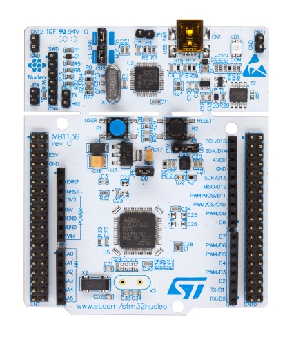

# Mbed OS6 Sanity-Preserving Introduction and Notes Collection
A sanity-preserving introduction to Mbed OS 6 and my collection of notes. Aiming to collect the reasonable documentation that does exist for Mbed OS 6 but can only be found by ignoring the years of outdated docs, examples, and forum discussions.

Mbed OS is overall a very solid RTOS with good device support and arduino-like abstraction while being much more powerful. However, it is still semi-obscure and at least in large part it has to be due to how frustrating it is to start. This guide aims to give an easy getting started path, and also collect resources on the easy and correct way to do things with Mbed OS 6.



# Introduction: A Sane Start
Mbed has many options for development: legacy compiler, keil studio online, mbed studio, mbed cli 1, mbed cli 2, dozens of development boards, and 5 distinct versions. This guide will use **Mbed Studio with Mbed 6.15**. The board used in writing this guide is the **Nucleo F303RE**.

This guide is meant to help in getting started with Mbed OS 6 without getting confused and giving up, particularly for someone that has spent some time with classic Arduino (AVR, 2K SRAM, one big loop, many globals, etc) and wants to try some projects on powerful 32 bit MCUs with more advanced abstractions (threads, queues, mutexes, etc) and hardware (tens / hundreds of MHz, 256KB+ flash, 32KB+ SRAM). If you have not used an RTOS before, you may want to find other sources that explain RTOS concepts in detail, as it will give you an idea of what Mbed OS feature you should use for each component of your program.

# Why use an RTOS? Why use Mbed OS?
The reason to use an RTOS is often linked more to the "RT" or "OS" than the full "RTOS". If you have a use case with hard real time requirements, then having a base layer of primitives designed for real time with predictable deadlines and guaranteed priorities is very useful. Or, you may need OS features over bare metal embedded because it really helps with the complexity of your app (eg networking and GUI and sensors and communication busses all at the same time - a lot easier to manage with threads). Mbed OS also comes with very useful abstractions of the core peripherals of the supported platforms, so you can easily use them without needing to change your code or understand them (up to a certain point). ARM says Mbed OS is be great for rapid IoT development, but you can also use it for rapid development without IoT.

## 1: Software and blinky
Reference: [Mbed docs quick start](https://os.mbed.com/docs/mbed-studio/current/getting-started/index.html)
- Acquire an mbed-capable board, ideally one of the better supported boards [with official mbed studio debug support](https://os.mbed.com/platforms/?q=&Mbed+Studio+support=Debug). Suggestion: Nucleo F303 or F411, they are <$15USD, widely used, and have a generous amount of flash and RAM.
- Install Mbed Studio
- Make a new project with the os 6 blinky code and mbed 6.15 (or later)
- Plug in your board and select yes when it asks if you want it to be the active board. You should see your board with a green USB icon under "Target" in the top left section of the interface.
- Build the blinky code (hammer icon). This will take a little while.
- Run the code (play button), which will download it to your board and reset the board. Observe the blinky.

Example file [Intro/01-Blinky/main.cpp](Intro/01-Blinky/main.cpp)

## 2: Printing Hello World
To get started with serial output, set up mbed_app.json to enable buffered serial and baudrate 115200:
```
{
    "target_overrides": {
        "*": {
            "target.components_add": [],
            "target.features_add": [],
            "target.features_remove": [],
            "target.c_lib": "std", 
            "target.printf_lib": "minimal", 
            "platform.stdio-buffered-serial": 1, 
            "platform.stdio-baud-rate": 115200
        }
    }
}
```
Modify the blinky example to include `printf("Hello world\n");` in the while loop. Set mbed studio to 115200 in the output tab for the board. Remember to include newlines with any printf that should display immediately.

Serial on mbed can get a lot more complicated (see feature section on serial) but this is a good place to start to have basic printf / scanf.

Example file [Intro/02-Printing/main.cpp](Intro/02-Printing/main.cpp)

## 3: Mbed RTOS basics: Threads, Sleep, and Tickers
Threads form the core of your app, as they will run over and over again and can do lengthy or blocking operations, unlike ISRs. The main() function in mbed is itself a thread. There [is also an idle thread](https://os.mbed.com/docs/mbed-os/v6.15/apis/scheduling-options-and-config.html) (for when all your code is sleeping), ISR/scheduler thread, and timer thread consuming 2KB total.

Here is how starting a thread in Mbed usually goes:
``` C++
//Globals section
Thread user_interface_thread; //defaults

//Thread function definition
void user_interface_loop()
{
    //init stuff
    ...init...
    //loop stuff
    while(true)
    {
        ...do_thread_activities...
        //Sleep allows other threads to run and the microcontroller to sleep
        ThisThread::sleep_for(1000ms);
    }
}

//in your main setup code
int main()
{
    //after this call, the user_interface_loop function will run on its own in its own thread
    user_interface_thread.start(&user_interface_loop);

    //main is its own thread, so you usually want to use it for something or it's wasted stack space
    while(true)
    {
        //...do things...
        ThisThread::sleep_for(1s);
    }
}

```

If you want to control the priority or stack size:

``` C++
Thread calculation_thread(osPriorityHigh, 1024);
```
Priority is a very important concept in real time systems. As a practical example, you wouldn't want some logging code to hog CPU time when the motor control calculations of your quadcopter need to run (and soon, before it loses control). You also wouldn't want the logging code to hog the SPI bus (eg to write to a flash chip) when the motor control thread needs it to send commands to a motor controller or get measurements from an IMU.


The thread function can a member function of a class with state:

``` C++
thread_obj.start(callback(&object_instance, &ClassBeingUsed::function_to_run_in_thread));
```

If you just want to do something like "run this function once per second", a Ticker is likely more appropriate:
``` C++
//globals section
Ticker reset_counter_ticker;
volatile int counter = 0; //imagine something else increments this

//ticker function
//some uses: flipping an LED at a certain interval, resetting a variable, creating an event at a fixed interval
//Note that ticker functions run in an interrupt context, so need to be done quickly and can't allocate memory
//If you want to do something once per second but it's blocking or allocating or needs printf, you'll want to look at having the Ticker ISR fire off an event in an EventQueue or set an Event Flag for a waiting thread.
void reset_counter_handler()
{
    counter = 0;
}

//in main setup code
int main()
{
    //Similar to threads, a member function of a class can also be used
    reset_counter_ticker.attach(&reset_counter_handler, 1.0);
}

```

Example file [Intro/03-RTOS-Threads-Timers/main.cpp](Intro/03-RTOS-Threads-Timers/main.cpp)


## 4: Mbed RTOS basics: Thread Communication
To share information between threads, two main concepts are involved:
- [Queue](https://os.mbed.com/docs/mbed-os/v6.15/apis/queue.html): Pointer values to any other type are sent from producer threads (or ISRs) to consumer threads (or ISRs)
- [Mail](https://os.mbed.com/docs/mbed-os/v6.15/apis/mail.html): Like a queue, but a pool of memory allows for actual messages to be stored, not just pointers. The mail type can be a primitive, struct, or even object.


There is also the lure of using shared memory: Global variables, pointers to a shared memory region, etc. You need the make sure writes are atomic (the whole value is written or nothing at all is written) and reads are atomic (you don't read some fraction of an old value and some fraction of a new value, eg 200 lines of an old image frame and 280 of a new frame). This could be ensured with thread synchronization primitives discussed next.

In the very simple case of one thread writing to a 32 bit value and another thread reading the value, then synchronization is not strictly required since ARM Cortex-M does 32 bit loads/stores.


## 5: Mbed RTOS basics: Thread Synchronization and Safety
Related to sharing information is synchronizing the execution of threads according to some desired sequence of events.
- [Mutex](https://os.mbed.com/docs/mbed-os/v6.15/apis/mutex.html) (Binary semaphore): A way to guard some kind of resource against more than one thread accessing it at a time. For example, Mbed uses a mutex to prevent conflicting access to an SPI bus.
- [ConditionVariable](https://os.mbed.com/docs/mbed-os/v6.15/apis/rtos-apis.html): Mutex with extra protection against race conditions that can be triggered when using it to wait for a condition to change. It is used for one thread to notify one or more other threads about something. The other threads can wait to be notified. For example, a consumer thread can sleep until the producer has finished producing.
- [EventFlags](https://os.mbed.com/docs/mbed-os/v6.15/apis/eventflags.html): If you want to have a way of notifying other threads about an event(s) happening (as defined by one of 31 bits in a 32 bit number). Some discussion [here](https://forums.mbed.com/t/how-to-use-multiple-flags-for-intra-thread-signaling/16115/4) and [here](https://os.mbed.com/questions/87206/EventFlags-behaviour/).

The Mbed documentation describes various APIs for how threads can notify each other and wait on certain events to happen. Basically, you don't want threads accessing things at the same time and causing havoc, and you don't want threads running out of the order they're meant to run and causing mayhem.

Example file [Intro/05-RTOS-Thread-Sync/main.cpp](Intro/05-RTOS-Thread-Sync/main.cpp)

## 6: Mbed Studio: Debugging basics
Reference on debugging [here](https://os.mbed.com/docs/mbed-studio/current/monitor-debug/debugging-with-mbed-studio.html).

The debugger is run by clicking the bug symbol next to the normal 
In the debugger, you can set breakpoints by clicking to the left of line numbers in source files. There are more advanced features such as conditional breakpoints, function breakpoints, logpoints, etc. When you hit a breakpoint, you can see at what state the other threads are paused too.

The debug console tab gives you full access to GDB. The debugger UI sometimes does strange things, in which case you can switch to the GDB console.

Post on tracing memory usage [here](https://os.mbed.com/blog/entry/Tracking-memory-usage-with-Mbed-OS/). If you are having memory problems (stack overflows, memory leaks) then additional statistics can be enabled and tracked.

## 7: Mbed hardware APIs: GPIO, Interrupts, ADC, PWM, I2C, SPI, etc
Note: Called [drivers](https://os.mbed.com/docs/mbed-os/v6.15/apis/drivers.html) by Mbed.

Some of the more commonly used drivers are:
- GPIO: DigitalIn, DigitalOut, and DigitalInOut. There are also classes for configuring Busses and Ports, also In/Out/InOut.
- Interrupts: InterruptIn, trigger an ISR on rising or falling
- ADC: AnalogIn. Result is given as unsigned 16 bit value, or float from 0.0 to 1.0. Run some tests with known voltages or a good multimeter / oscilloscope for reference to make sure the ADC accuracy is good enough for you.
- DAC: AnalogOut. Also takes u16 or float from 0.0 to 1.0.
- PWM: PwmOut. Period and duty or pulsewidth can be set.
- I2C: I2C. Default frequency 100kHz. An I2CSlave class is also available.
- SPI: SPI. Default frequency 1MHz. QSPI and SPISlave also available.
- USB: Many USB classes are available for keyboard / mouse / audio / serial / etc.
- Others: There are other drivers such as for accessing internal flash, configuring a watchdog, CAN, (Un)Buffered serial, and hardware CRC.

Some drivers are not supported by every vendor, and some may be unimplemented on specific devices or device families.

In general you want to figure out a good way of letting the peripherals act on their own as much as possible by quickly relaying events over to threads that can handle them.

## 8: How do I figure out how to do something in Mbed OS I could do with Arduino?
One way to design RTOS apps is threads with responsibilities for specific tasks that communicate with each other as necessary. Blocked or sleeping threads are pre-empted, allowing for other tasks to run.  Using RTOS primitives (threads, queues, events, flags, mutexes) and C++ methods (objects with state rather than globals, functionality split up by classes) generally results in more modern and clean designs. 

Since this is embedded, there will also be callback functions (ISR) for events such as a GPIO interrupt, or an IO buffer filling up, or a timer interrupt. These will typically be at the "edge" of your program design, allowing information about the external world to get in and the program's reaction to get out.

So your initial plan will list the various things you want your program to do, and then which thread (or ISR) will be responsible for each thing. Then, by what means threads will communicate and synchronize. Most RTOS have very similar primitives that match concepts discussed in RTOS textbooks, so discussion and tutorials on how to do things with other RTOS (FreeRTOS, Mynewt, Zephyr, etc) will be very relevant to Mbed OS too. However, it is worth noting that by default each thread will take up 4K of RAM in stack space, so for larger apps you should size threads with an appropriate stack size and not use too many. It's perfectly fine to have few threads or even just your main() thread, such as if most of your functionality can be handled with GPIO / Ticker / other peripheral interrupts.

Another major way to design RTOS apps is to use events in event queues to structure how the system reacts to inputs. Events can quickly be registered in ISRs or other threads and then handled later by the relevant function (which run in a thread created by the EventQueue class).

However, this can all be hard to think about when starting out with Mbed OS. For example, in Arduino projects it is fairly common to have a large set of global variables, a superloop, and have different sections of code communicate through global variables. When starting with Mbed it may be easier to think about putting each major section of superloop code (eg GUI, network, data processing) in its own thread that runs at the appropriate interval using ThisThread::sleep and keep the same structure of global variables, but now use Mutexes or ConditionVariables to synchronize thread access. Later, an appropriate RTOS communication method can replace the majority of the global variables, particularly the ones used for communication. Globals used for ISRs can be enclosed in objects that control external access to the volatile variable.

As for how to literally do things in Mbed OS that are possible in Arduino with respect to libraries and peripheral support, you will need to track down a library written for Mbed OS 6, port one written for Mbed OS 5 (probably minimal or no changes), port the Arduino library (likely medium effort, you can also write your own library using the Arduino one as a guide), or write your own from the datasheet.

## 9: What do I do when I get *really* stuck?
Now is a good time to explain what it takes to make reasonable progress on an Mbed project (really, any embedded project) when you run into issues:
- Read the Mbed OS [docs](https://os.mbed.com/docs/mbed-os/v6.15/apis/index.html) related to whatever you are doing thoroughly.
- Search the [forums](https://forums.mbed.com/) (the built in search tool and Google for the occasional result in blogs, stackoverflow, etc) for any problems you're having - there will usually be someone else with the question, and they usually did get some kind of answer.
- Understand your underlying hardware - Mbed OS is a decent abstraction but not a perfect one. If you're doing something that makes non-trivial use of an MCU peripheral, it's a good idea to read the datasheet to find out what you're really using underneath. If you run into problems, you definitely need to check the datasheet and the vendor forums. Check the MCU errata too, silicon vendors make a [shocking amount](https://www.reddit.com/r/embedded/comments/htcdnw/lpt_when_you_are_starting_with_a_new_mcu_read/) of [mistakes in silicon](https://www.reddit.com/r/embedded/comments/qi5f97/are_modern_socs_becoming_less_usable/). While you're on the vendors website, check out their other documents too - application notes are 100 times more readable than datasheets and usually give great instructions on how to get things done. Reference manuals and programming manuals will give a much more straightforward answer of "how" to use an MCU than the datasheet.
- See what clues you can find with the debugger and/or external logic analyzer or oscilloscope.
- If all of the above fails, ask nicely on the Mbed forums or r/embedded. Make sure to explain what you are trying to do overall, what your problem is, and what you've tried so far to solve it. If your problem is more related to your specific microcontroller (eg Mbed appears to be working fine but your ADC has a lot of noise), then also try the vendor specific forums.

# 10: Configuration: mbed_app.json
This file is very important as it allows you to enable, disable, and configure features such as your c_lib and printf_lib. However, it is not created by default in Mbed Studio!
Here is an example mbed_app.json with a few things configured:
```
{
    "target_overrides": {
        "*": {
            "target.components_add": [],
            "target.features_add": [],
            "target.features_remove": []
            "target.c_lib": "std",
            "target.printf_lib": "minimal",
            "platform.stdio-baud-rate": 115200,
            "platform.stdio-buffered-serial": 1
        }
    }
}
```

Docs on mbed_app.json can be found [here](https://os.mbed.com/docs/mbed-os/v6.15/program-setup/advanced-configuration.html#configuration-parameters-in-mbed-app-json-mbed-lib-json).
- [RTOS configuration params](https://os.mbed.com/docs/mbed-os/v6.15/apis/scheduling-options-and-config.html)
- [Mbed Driver params](https://os.mbed.com/docs/mbed-os/v6.15/apis/drivers-options-and-config.html)
- [Mbed platform params](https://os.mbed.com/docs/mbed-os/v6.15/apis/drivers-options-and-config.html)
- [Mbed data store params](https://os.mbed.com/docs/mbed-os/v6.15/program-setup/api-specific-configuration.html)
- [Mbed connectivity params](https://os.mbed.com/docs/mbed-os/v6.15/apis/connectivity-options-and-config.html) (see the protocol specific params too)

Configuration can get quite advanced, such as setting [target-specific parameters](https://os.mbed.com/docs/mbed-os/v6.15/program-setup/advanced-configuration.html).

Discussion on how to find the specific configurable parameters (eg UART buffer size) found [here](https://forums.mbed.com/t/hitchhikers-guide-to-printf-in-mbed-6/12492/19)

## 11: Further Reading
The Mbed OS [full API reference](https://os.mbed.com/docs/mbed-os/v6.15/apis/index.html) contains information about most parts of Mbed OS with some small explanations and examples. It's worth skimming through the list to see what sort of things are available. If you are still using Mbed in a month, then skim the entire documentation - Mbed OS has so many neat features and customizable aspects.
There is also a section on [platform concepts](https://os.mbed.com/docs/mbed-os/v6.15/apis/platform-concepts.html) that explains some of the more important mbed-specific concepts.
Finally, figuring out things in mbed sometimes involves searching through the [forums](https://forums.mbed.com/c/mbed-os/6) or [class hierarchy](https://os.mbed.com/docs/mbed-os/v6.15/mbed-os-api-doxy/hierarchy.html) or even checking the [source code](https://github.com/ARMmbed/mbed-os/tree/mbed-os-6.15.1).


# Tips for Mbed / Mbed Studio
### Studio: Shared mbed library to save 1GB per application
Re-use the mbed os library from a single program (eg, the blinky program) where possible. Otherwise you are duplicating 1GB of Mbed files for each application in Mbed Studio.

### Reducing compile time (initial, and whenever a library or mbed config file is changed)
By default mbed has a LOT of extra stuff that it compiles for absolutely no reason on most projects. Zoltan Hudak has written a [.mbedignore file](https://forums.mbed.com/t/how-to-shorten-compilation-time-up-to-six-times/11203/22) that cuts out a lot of the unneeded libraries, drastically decreasing full-build compile time. However, make sure you do read through all the excluded directories and comment out any that you actually need. If you start running into strange compilation errors, try temporarily commenting out your entire .mbedignore.

### Studio: It totally broke and won't compile / download libraries / detect boards

Mbed studio likes to do strange things. Most seem to be fixed by restarting it. However, after some time, you may need to uninstall and delete leftover files before reinstalling. Mbed Studio 1.4.4 stopped working with libraries at all for me and I had to uninstall, delete these directories:
- ...AppData\Local\Mbed Studio
- ...AppData\Local\mbedls
- ...AppData\Local\mbed-studio-updator
- ...home directory...\.mbed
- ...home directory...\.theia

And then reinstall Mbed Studio. Some of the above directories might not need to be deleted, but I didn't isolate which one was specifically causing problems. The locations may be different for Global install vs User install.

# Mbed examples
There are actually a decent number of mbed os6 examples, but they are easy to miss. They are summarized in the [tutorials and examples section](https://os.mbed.com/docs/mbed-os/v6.15/tutorials/index.html) of the docs. Repositories for them can be found on the [ARMmbed github account](https://github.com/orgs/ARMmbed/repositories?q=example&type=all&language=&sort=).
A number of examples can be found in the Examples/ directory of this repository. The [Mbed OS documentation](https://os.mbed.com/docs/mbed-os/v6.15/apis/index.html) contains examples for standalone usage of most APIs, so the examples here focus more on practical usage or what is unclear in the Mbed docs.

# Mbed libraries
Finding mbed libraries for components can be frustrating compared to the ease of arduino but libraries do exist for many components. A good place to start is the [mbed repository search](https://os.mbed.com/code/).


    
# Other tutorials / resources
- Hackaday mbed USB volume control with F411: https://hackaday.com/2022/04/19/arm-pumps-up-the-volume-with-mbed-and-a-potentiometer/
- EFI ECU project written in mbed: https://github.com/FL0WL0W/EFIGenie
- Mbed audio player example: 
- [LekaOS](https://github.com/leka/LekaOS): Uses MbedOS plus a whole mock core / library layer above Mbed. Made to implement the software for a robot for disabled childrne. Uses many peripherals / sensors. Check out the libs, drivers, and app directories (or search, it's a lot of code). The spikes directory seems to have a ton of small test programs. Also see [here](https://forums.mbed.com/t/high-level-mbed-os-testing/13590) for some discussion by one of the authors. Almost every feature of Mbed appears to have been used.

# Other suitable STM32 boards for starting off with Mbed
Some other potentially suitable beginner-friendly options would be the Nucleo F411RE, F429ZI, F446ZE, or F401RE. Many other boards will work but may require additional configuration and/or installing a custom target.